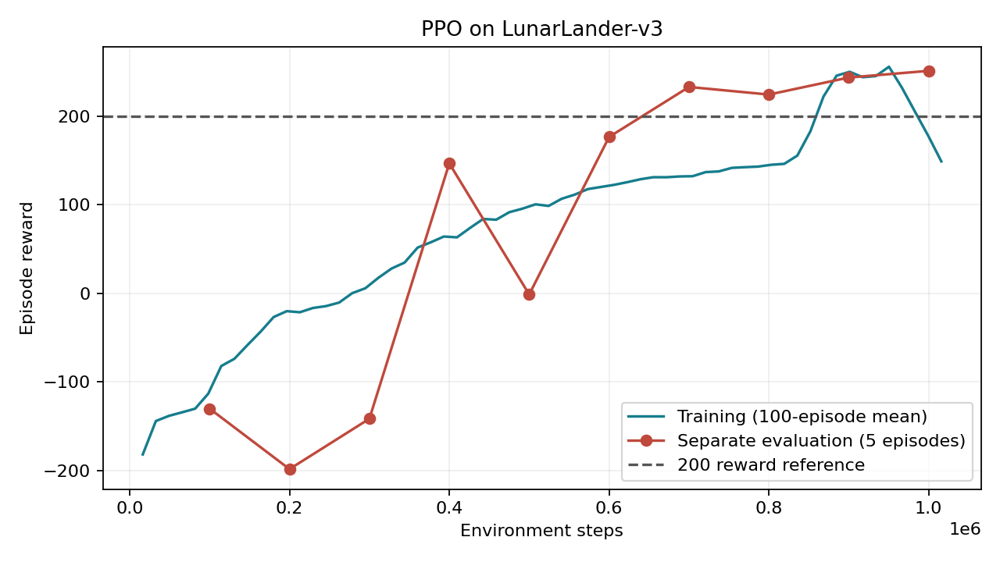

# 第 1 周：深度强化学习与开源仿真环境实践

完成 Gymnasium LunarLander-v3、Stable-Baselines3 PPO、16 个并行环境、100 万步训练、独立评估与视频回放，并验证 Shimmy、MuJoCo 和 Genesis。

已发布模型：[ZZW-Echo/ppo-LunarLander-v3](https://huggingface.co/ZZW-Echo/ppo-LunarLander-v3)。原始 10 局评分为 **229.74 ± 16.79**，实际训练 1,015,808 步。详情见 [实验结果](reports/results.md) 和 [每局评分](reports/metrics.json)。

**视频回放：[打开 GitHub 视频文件](reports/replay.mp4) · [直接观看或下载 MP4](https://github.com/Morri-Echo/lunarlander-upload/raw/refs/heads/main/reports/replay.mp4) · [Hugging Face 内嵌播放器](https://huggingface.co/ZZW-Echo/ppo-LunarLander-v3#replay)**



## 新电脑安装

已验证平台：**Windows x64 / Python 3.9**。先安装 Python 3.9 64 位和 Git，再克隆仓库或下载 GitHub ZIP 解压：

```powershell
git clone https://github.com/Morri-Echo/lunarlander-upload.git
Set-Location lunarlander-upload
```

在项目目录打开 PowerShell：

```powershell
powershell -NoProfile -ExecutionPolicy Bypass -File .\scripts\setup.ps1
.\.venv\Scripts\python.exe -m src.smoke_test
```

安装脚本创建本机虚拟环境、安装固定依赖并检查依赖冲突，无需激活环境。Python Launcher 不可用时指定 Python：

```powershell
powershell -NoProfile -ExecutionPolicy Bypass -File .\scripts\setup.ps1 -Python 'D:\Python39\python.exe'
```

也可以使用 Conda：

```powershell
conda create -n week1 python=3.9 -y
conda activate week1
python -m pip install pip==25.3 setuptools==75.8.2 wheel==0.45.1
python -m pip install -r requirements.txt -c requirements-lock.txt
python -m src.smoke_test
```

后续命令中的虚拟环境 Python 可替换为已激活 Conda 的 `python`。路径可不同，不依赖原电脑用户目录。核心 PPO 使用 CPU，不要求 NVIDIA GPU；MuJoCo 渲染需要正常图形驱动。安装与模型下载需要网络。

## 下载模型并复现评分

无需登录 Hugging Face，也无需重新训练：

```powershell
.\.venv\Scripts\python.exe -m src.download_model --with-replay
.\.venv\Scripts\python.exe -m src.evaluate --episodes 10
```

默认下载已验收提交 `7a877388a09ea9fc8f7820ae6127e13390d4c200` 的模型到 `outputs/ppo/`。公开历史评分和视频放到 `outputs/published-reference/`。评估使用 seed 12345 和确定性策略，生成 `outputs/evaluation/evaluation.json`、`replay-0.mp4`、截图。不同系统和数值库可能产生小幅差异，以实际输出为准。

## 从头训练

完整运行环境检查、16 进程训练、10 局评估、视频、曲线与汇总：

```powershell
powershell -NoProfile -ExecutionPolicy Bypass -File .\scripts\run_experiment.ps1
```

手动运行：

```powershell
.\.venv\Scripts\python.exe -m src.train --steps 1000000 --envs 16 --backend subproc
.\.venv\Scripts\python.exe -m src.evaluate --episodes 10
.\.venv\Scripts\python.exe -m src.plot_results
.\.venv\Scripts\python.exe -m src.export_report
```

参数与 PPT 一致：MlpPolicy、n_steps=1024、batch_size=64、n_epochs=4、gamma=0.999、gae_lambda=0.98、ent_coef=0.01，seed 42。每批 16384 步，请求 1,000,000 步实际为 1,015,808。训练期每 100,000 步评估 5 局，每 250,000 步保存 checkpoint；最终另用 seed 12345 评估 10 局。

内存较小可使用 `--envs 4` 或 `--backend dummy`，这会改变训练过程。短流程测试可以传 `-Steps 16384`，短训练评分不代表完整模型表现。续训用新输出目录：

```powershell
.\.venv\Scripts\python.exe -m src.train --resume outputs/ppo/ppo-LunarLander-v3.zip --steps 1000000 --output outputs/continued
.\.venv\Scripts\python.exe -m src.evaluate --model outputs/continued/ppo-LunarLander-v3.zip --output outputs/continued-evaluation
```

## 文件结构

| 路径 | 内容 |
| --- | --- |
| `src/`、`scripts/` | 实验代码、安装及运行入口 |
| `requirements*.txt` | 核心依赖及完整版本快照，Genesis 独立安装 |
| `reports/` | 首次完整实验的评分、曲线、发布和迁移验收记录 |
| `reports/replay.mp4` | 原始已训练模型的 395 帧视频回放，随代码提交 |
| `reports/original-training/` | 首次训练 CSV、评估数组、配置与耗时 |
| `docs/simulators.md` | 仿真安装说明、Isaac 未验收状态 |
| `outputs/` | 本次模型、评分、视频、曲线、latest-metrics.json，Git 忽略 |
| `archives/original-outputs.zip` | 首次完整实验输出备份，已上传 GitHub，约 1.2MB |
| `archives/migration-outputs.zip` | 整理后迁移验证输出，仅本地保留 |
| `.github/workflows/` | Windows/Python 3.9 自动安装及环境验证 |
| `tests/` | 项目迁移路径和模型打包检查 |

历史报告保留原实验结果，新运行默认只写 `outputs/`。汇总时未执行的模块标记为 not_run。原 PPT 留在本地，不包含在代码仓库中。

重绘原始训练曲线：

```powershell
.\.venv\Scripts\python.exe -m src.plot_results --input reports/original-training --output outputs/original-training.png
```

## 其他 PPT 实践

旧模型使用课程指定仓库实际存在的 `ppo-LunarLander-v2.zip`，Gym LunarLander-v2 经 Shimmy 兼容后评估：

```powershell
.\.venv\Scripts\python.exe -m src.legacy_hub
```

Genesis 独立安装与 CPU 验证：

```powershell
powershell -NoProfile -ExecutionPolicy Bypass -File .\scripts\setup.ps1 -Genesis
.\.venv-genesis\Scripts\python.exe -m src.genesis_check
```

Genesis 固定 MuJoCo 3.2.5，主实验固定 3.3.7。Isaac Sim 需要 Python 3.11 和满足对应版本要求的硬件，尚未完整运行，详见 [仿真说明](docs/simulators.md)。OMPL 和 splashsurf 为 PPT 可选工具。

## Hugging Face 再发布

公开模型下载不需要账号；向自己的仓库发布需要写入 token：

```powershell
$env:HF_HOME = "$PWD\.cache\huggingface"
.\.venv\Scripts\hf.exe auth login
.\.venv\Scripts\python.exe -m src.hub --upload --repo YOUR_USERNAME/ppo-LunarLander-v3
```

打包前先完成对应模型的评估和视频生成。token 保存在被 Git 忽略的缓存目录，不写入代码。

## 上传 GitHub

代码仓库：[Morri-Echo/lunarlander-upload](https://github.com/Morri-Echo/lunarlander-upload)。克隆后提交后续修改：

```powershell
git add .
git status
git commit -m "Update week 1 RL practice"
git push origin main
```

提交代码、依赖、文档、原始输出归档 `archives/original-outputs.zip`、原始回放 `reports/replay.mp4` 和自动验证。环境、缓存、token、模型、新运行生成的视频、原 PPT 及迁移测试归档不会提交。模型和视频也有公开 Hugging Face 下载入口。GitHub Actions 检查依赖、迁移处理和环境接口，不做完整训练、Genesis 或 Isaac 验收。GitHub Windows runner 无可用 OpenGL 驱动，因此自动检查显式传入 `--skip-mujoco-render`，保留 MuJoCo 物理检查并在结果中记录渲染跳过；本地默认 smoke test 仍检查 MuJoCo 渲染。

## 兼容性

Python 3.9 是课程已验证版本，直接更换新版本需重新检查旧 Gym 和 Genesis 兼容性。`requirements-lock.txt` 和 `requirements-genesis-lock.txt` 是已验证 Windows/Python 3.9 的完整版本约束，配合主依赖文件安装；不保证 macOS/Linux 的全部 wheel 可用。Linux 无显示渲染可能需要 EGL/OSMesa。

Windows 使用 Box2D 2.3.10 wheel 避免 SWIG 编译；NumPy 1.26.4 保留旧 Gym 兼容。Gym 停止维护提示为预期提示。仅加载自己或课程指定的可信模型，SB3 模型包含 pickle 数据。

参考：[课程 Unit 1](https://colab.research.google.com/github/huggingface/deep-rl-class/blob/master/notebooks/unit1/unit1.ipynb)。
